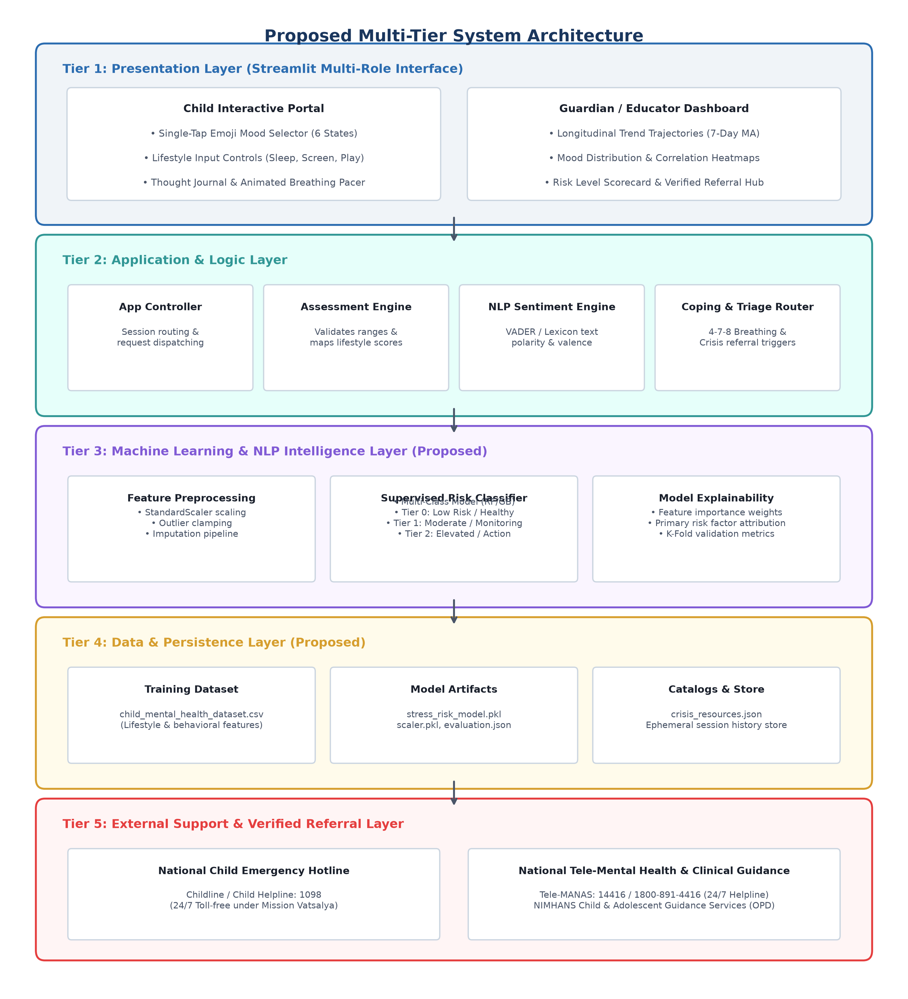
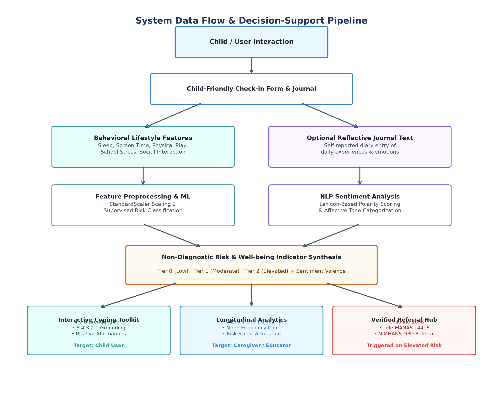
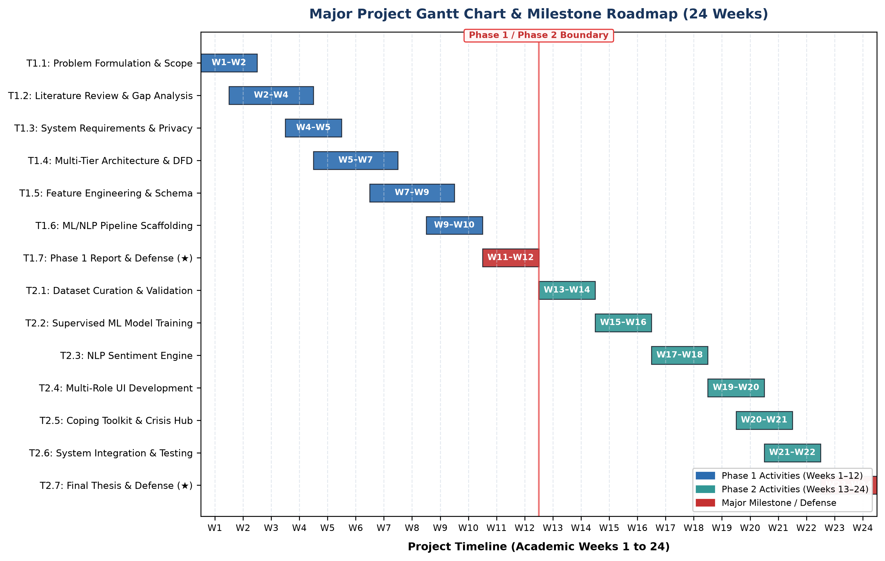

# PROJECT REPORT
ON

## MENTAL HEALTH AND WELL-BEING SURVEILLANCE, ASSESSMENT AND TRACKING SOLUTION AMONG CHILDREN

Submitted in partial fulfillment of the requirements for the degree of

### BACHELOR OF TECHNOLOGY
IN
### COMPUTER SCIENCE AND ENGINEERING

**Student:**  
Harsha R  
**USN:**  
20231CSE0261  

**Under the Guidance of:**  
Mr. Jetti Satya Sai Kumar  
Assistant Professor, Department of Computer Science and Engineering  

**University:**  
Presidency University, Bengaluru  

**Academic Year:**  
2026–2027  

---

## Executive Summary / Abstract

Childhood and adolescent psychological distress often develops gradually, with early manifestations reflected in observable lifestyle and behavioral changes such as irregular sleep patterns, excessive screen time, academic strain, and social withdrawal. However, conventional pediatric mental health screening approaches are largely episodic, adult-centric, and dependent on structured clinical consultations that may not capture gradual behavioral shifts in everyday environments.

This academic project, titled **“Mental Health and Well-being Surveillance, Assessment and Tracking Solution Among Children”**, proposes the design of an interactive, non-clinical software platform for early well-being surveillance, multi-factor behavioral assessment, longitudinal tracking, and verified support referral. The proposed platform incorporates a child-friendly interface featuring emoji-based mood check-ins and an optional reflective text journal. The conceptual architecture includes: (1) a proposed supervised machine learning classification workflow designed to stratify non-diagnostic well-being indicators into risk tiers (*Low / Healthy*, *Moderate / Monitoring*, and *Elevated / Action Advised*), and (2) a natural language processing (NLP) sentiment module intended to evaluate emotional valence and affective tone from self-reported text entries. Furthermore, the platform integrates non-clinical psychoeducational exercises (such as visual 4-7-8 breathing pacing and grounding activities) for children, alongside a proposed caregiver/educator dashboard displaying longitudinal trend trajectories and verified crisis contact directories (e.g., Childline 1098, Tele-MANAS 14416).

**Medical and Ethical Disclaimer:** This platform is designed strictly as an academic research prototype for surveillance, well-being tracking, and non-clinical decision support. It does not provide medical diagnoses, psychiatric evaluations, or clinical therapies. Clinical evaluation by qualified healthcare professionals is required for all medical and psychiatric decisions.

**Keywords:** Pediatric Well-being, Mental Health Surveillance, Digital Health Tracking, Machine Learning, Natural Language Processing, Child-Computer Interaction, Crisis Referral.

---

## Table of Contents
1. [1. Section 1: Literature Review & Research Gap](#1-section-1-literature-review--research-gap)
   - 1.1 Thematic Survey of Existing Literature
   - 1.2 In-Depth Analysis of Key Research Papers
   - 1.3 Comparative Analysis Matrix
   - 1.4 Identified Research Gaps & Problem Statement
2. [2. Section 2: System Architecture Design](#2-section-2-system-architecture-design)
   - 2.1 Design Philosophy & Multi-Tier Architecture
   - 2.2 System Architecture Diagram
   - 2.3 Component Input / Output Specifications
   - 2.4 Data Flow Modeling
   - 2.5 Privacy, Security, Consent, and Child Safety Protocols
3. [3. Section 3: Expected System Outputs](#3-section-3-expected-system-outputs)
   - 3.1 Functional Output Deliverables
   - 3.2 Non-Diagnostic Clinical Disclaimer
4. [4. Section 4: Project Timeline & Gantt Chart](#4-section-4-project-timeline--gantt-chart)
   - 4.1 Work Breakdown Structure (WBS)
   - 4.2 Project Timeline & Milestones
5. [5. References](#5-references)

---

# 1. Section 1: Literature Review & Research Gap

## 1.1 Thematic Survey of Existing Literature
The literature addressing youth mental health surveillance and digital tracking intersects multiple disciplines, spanning epidemiology, human-computer interaction (HCI), machine learning (ML), and clinical psychology:
* **Pediatric Mental Health Landscape:** Epidemiological surveillance frameworks (WHO, 2022; Bitsko et al., 2022) establish that anxiety, behavioral disorders, and mood dysregulation in children and adolescents often correlate with disruptions in core lifestyle routines, particularly sleep sufficiency and physical activity.
* **Digital Health Interventions for Youth:** Systematic reviews (Hollis et al., 2017; Grist et al., 2017) indicate that digital tracking and computerized cognitive behavioral support can positively influence youth engagement, but user retention depends strongly on age-appropriate visual interfaces and immediate interactive feedback.
* **Machine Learning for Risk Estimation:** Healthcare informatics literature (Shatte et al., 2019; Burke et al., 2019) highlights the utility of supervised learning models (such as decision trees, random forests, and logistic regression) in modeling non-linear interactions across multidimensional survey data, while emphasizing the critical necessity of avoiding methodological overfitting.
* **NLP and Affective Sentiment Mining:** Natural language processing studies (Hutto & Gilbert, 2014; Le Glaz et al., 2021) demonstrate that lexicon-based sentiment analysis effectively captures valence and emotional polarity in informal text, providing useful supplementary signals when combined with structured behavioral data.
* **Ethics, Privacy, and Child Safety:** Data protection research (Schueller et al., 2019) and legal frameworks (such as the Digital Personal Data Protection Act, 2023 in India) mandate strict data minimization, verifiable parental consent, and non-diagnostic disclaimers when processing data related to minors.

---

## 1.2 In-Depth Analysis of Key Research Papers

### 1. Global Pediatric Mental Health Burden (WHO, 2022)
* **Citation:** World Health Organization, *World Mental Health Report: Transforming mental health for all*, Geneva: WHO, 2022.
* **Methodology:** Meta-synthesis of epidemiological registries, population surveys, and global health data across WHO Member States.
* **Key Findings:** Globally, an estimated 1 in 7 (14%) 10–19 year-olds experience mental health conditions, with suicide representing the fourth leading cause of death among older adolescents (15–19 years). Early-stage emotional distress is frequently unaddressed in community settings.
* **Limitations:** Macro-level global policy focus; does not specify software implementations or algorithmic designs.
* **Relevance to Proposed System:** Confirms the epidemiological need for accessible, early surveillance and supportive monitoring tools.

### 2. Pediatric Mental Health Surveillance in the United States (Bitsko et al., 2022)
* **Citation:** R. H. Bitsko et al., "Mental Health Surveillance Among Children — United States, 2013–2019," *MMWR Supplements*, vol. 71, no. 2, pp. 1–42, 2022.
* **Methodology:** Analysis of multiple federal surveillance datasets, including the National Survey of Children's Health (NSCH), NHIS, and YRBSS.
* **Key Findings:** ADHD and anxiety were the most commonly diagnosed conditions among children aged 3–17 years. Surveillance data confirmed that lifestyle behaviors and environmental stressors are key correlates of emotional well-being.
* **Limitations:** Data relied on periodic, retrospective caregiver and self-report surveys; does not provide real-time tracking.
* **Relevance to Proposed System:** Supports the inclusion of multi-variable behavioral parameters (sleep, physical play, screen time) in lifestyle feature vectors.

### 3. Digital Health Interventions for Children and Young People (Hollis et al., 2017)
* **Citation:** C. Hollis et al., "Digital health interventions for children and young people with mental health problems – a systematic and meta-review," *Journal of Child Psychology and Psychiatry*, vol. 58, no. 4, pp. 474–503, 2017.
* **Methodology:** Systematic review and meta-review synthesizing systematic reviews and randomized controlled trials (RCTs) of computerized CBT, apps, and digital platforms.
* **Key Findings:** Digital interventions demonstrate clinical promise, particularly computerized CBT for anxiety and depression in youth. The authors emphasized that engagement and adherence require interactive design, human support, and consideration of younger demographics.
* **Limitations:** Identified a scarcity of digital interventions specifically tailored for younger children compared to older adolescents.
* **Relevance to Proposed System:** Directs the user-interface design toward interactive, visual, and low-cognitive-load workflows.

### 4. Systematic Review of Mobile Mental Health Apps for Youth (Grist et al., 2017)
* **Citation:** R. Grist, J. Porter, and P. Stallard, "Mental Health Mobile Apps for Preadolescents and Adolescents: A Systematic Review," *Journal of Medical Internet Research*, vol. 19, no. 5, p. e176, 2017.
* **Methodology:** Systematic review across scientific databases and commercial app stores evaluating app features, target populations, and evidence bases.
* **Key Findings:** Most available mental health applications targeted adults or older adolescents; very few were specifically developed for preadolescents. Additionally, many apps lacked clear clinical safety mechanisms or verified emergency referrals.
* **Limitations:** Rapid turnover of commercial app store offerings limited long-term follow-up.
* **Relevance to Proposed System:** Highlights the specific preadolescent gap and emphasizes the requirement for integrated, verified crisis referral pathways.

### 5. Scoping Review of Machine Learning in Mental Health (Shatte et al., 2019)
* **Citation:** A. B. Shatte, D. M. Hutchinson, and S. J. Teague, "Machine learning in mental health: a scoping review of methods and applications," *Computer Methods and Programs in Biomedicine*, vol. 175, pp. 219–224, 2019.
* **Methodology:** Scoping review of 300 peer-reviewed articles evaluating algorithm types, data modalities, and validation standards.
* **Key Findings:** Supervised classification algorithms (such as Random Forests, Support Vector Machines, and Logistic Regression) are frequently used across mental health datasets. The study underscored the critical need for rigorous cross-validation to mitigate overfitting risks.
* **Limitations:** Noted a predominance of adult cohorts and tabular survey samples.
* **Relevance to Proposed System:** Informs the selection of supervised classification models for risk estimation while reinforcing the necessity of strict validation protocols in Phase 2.

### 6. Predictor Identification Using Machine Learning in Youth (Burke et al., 2019)
* **Citation:** T. A. Burke et al., "Identifying the Most Important Predictors of Non-Suicidal Self-Injury in Adolescents: Using Machine Learning," *Journal of Consulting and Clinical Psychology*, vol. 87, no. 11, pp. 978–992, 2019.
* **Methodology:** Machine learning modeling (including Random Forests and Elastic Net Regularization) on multidimensional behavioral inventories in a cohort of 496 adolescents.
* **Key Findings:** Multi-variable modeling identified interactions between sleep disruptions, negative affect, and interpersonal stress, demonstrating the value of multi-factorial feature sets.
* **Limitations:** Focused on a high-risk clinical adolescent sample rather than general school-level surveillance.
* **Relevance to Proposed System:** Supports the methodological choice of combining sleep, mood, and social variables into unified feature vectors.

### 7. Systematic Review of NLP and ML in Mental Health (Le Glaz et al., 2021)
* **Citation:** A. Le Glaz et al., "Machine Learning and Natural Language Processing in Mental Health: Systematic Review," *Journal of Medical Internet Research*, vol. 23, no. 5, p. e15708, 2021.
* **Methodology:** Systematic review of 199 studies indexed across PubMed, IEEE Xplore, and ACM Digital Library.
* **Key Findings:** NLP methods reliably extract affective sentiment, valence, and psychological markers from unstructured text. The authors noted that NLP provides subjective context but is most effective when integrated with structured behavioral data.
* **Limitations:** High complexity of deep-learning NLP models can hinder interpretability in health applications.
* **Relevance to Proposed System:** Justifies the use of interpretable, lightweight sentiment analysis for optional journal reflections alongside structured inputs.

### 8. Lexicon and Rule-Based Sentiment Analysis (Hutto & Gilbert, 2014)
* **Citation:** C. J. Hutto and E. Gilbert, "VADER: A Parsimonious Rule-based Model for Sentiment Analysis of Social Media Text," *Proceedings of the Eighth International AAAI Conference on Weblogs and Social Media (ICWSM-14)*, pp. 216–225, 2014.
* **Methodology:** Developed a gold-standard sentiment lexicon combining human ratings with grammatical and syntactical heuristics (negations, intensifiers, punctuation).
* **Key Findings:** The rule-based approach achieved strong classification performance on informal short texts while operating with low computational overhead and full interpretability.
* **Limitations:** Evaluates linguistic sentiment polarity, not psychiatric distress or clinical affect.
* **Relevance to Proposed System:** Provides a lightweight, privacy-preserving method for computing emotional valence scores on-device without remote data transmission.

### 9. Pediatric Symptom Checklist (PSC-17) (Gardner et al., 1999)
* **Citation:** W. Gardner et al., "The PSC-17: a brief pediatric symptom checklist with psychosocial subscales," *Ambulatory Child Health*, vol. 5, no. 3, pp. 225–236, 1999.
* **Methodology:** Psychometric evaluation and factor analysis across 21,065 pediatric cases aged 4–15 years in primary care settings.
* **Key Findings:** Validated a three-factor subscale structure (internalizing, externalizing, attention) that effectively identifies psychosocial impairment.
* **Limitations:** Designed as a parent/clinician completed paper screener rather than an interactive child self-report tool.
* **Relevance to Proposed System:** Informs the selection of behavioral domains (internalizing emotions, attention, lifestyle) used to structure non-clinical assessment questions.

### 10. Privacy and Security in Digital Mental Health (Schueller et al., 2019)
* **Citation:** S. M. Schueller, C. M. Armstrong, and M. Neary, "Privacy and Security in Digital Mental Health," in *Digital Mental Health*, Cham: Springer, 2019, pp. 77–94.
* **Methodology:** Critical review of regulatory standards, consent workflows, and privacy implementations across digital health applications.
* **Key Findings:** Emphasized the critical importance of transparent consent, data minimization, secure local handling of sensitive reflections, and clear non-diagnostic boundaries when developing health tools.
* **Limitations:** Provides policy and design recommendations rather than software implementation source code.
* **Relevance to Proposed System:** Directly guides the ethical, security, and consent architecture of the proposed platform.

---

## 1.3 Comparative Analysis Matrix

| Literature Source | Focus Domain | Target Cohort | Primary Technology | Identified Limitation |
|---|---|---|---|---|
| **WHO (2022)** | Global Epidemiology | Global Youth | Meta-Synthesis | High-level policy; lacks software architecture |
| **Bitsko et al. (2022)** | Public Surveillance | Children (3–17 yrs) | Federal Survey Data | Retrospective annual data; no real-time tracking |
| **Hollis et al. (2017)** | Digital Health Reviews | Children & Youth | Meta-Review of RCTs | High attrition if interfaces lack engagement |
| **Grist et al. (2017)** | Mobile Apps Review | Preadolescents & Youth | App Store Review | Few apps for preadolescents; limited crisis handling |
| **Shatte et al. (2019)** | ML Scoping Review | General Population | Scoping Review (RF, SVM) | Overfitting risks; predominantly adult datasets |
| **Burke et al. (2019)** | Risk Predictor Modeling | Adolescents | Decision Trees, RF | Confined to high-risk clinical adolescent cohorts |
| **Le Glaz et al. (2021)** | NLP in Mental Health | Mixed Cohorts | Systematic Review | Deep NLP lacks explainability; text-only bias |
| **Hutto & Gilbert (2014)** | Sentiment Analysis | Short Digital Text | Rule-Based Lexicon (VADER) | Measures linguistic valence, not clinical affect |
| **Gardner et al. (1999)** | Pediatric Screener | Children (4–15 yrs) | Psychometric Factor Analysis | Paper-based, clinician/parent completed tool |
| **Schueller et al. (2019)**| Privacy & Safety | Digital Health Users | Security & Compliance Audit | Policy-oriented; lacks software implementation |

---

## 1.4 Identified Research Gaps & Problem Statement

### Research Gaps:
1. **Opportunity for Age-Appropriate Interaction:** While digital interventions exist for older adolescents and adults, there remains a distinct scarcity of digital well-being platforms designed specifically for preadolescents using intuitive, visual, and low-cognitive-load interactions.
2. **Opportunity for Multi-Modal Data Synthesis:** Existing applications predominantly analyze either structured lifestyle survey questions or unstructured text in isolation. An opportunity exists to synthesize daily emoji mood logs, structured behavioral metrics (sleep, screen time, physical play, academic stress), and optional text sentiment into an integrated assessment pipeline.
3. **Opportunity for Continuous Longitudinal Surveillance:** Most pediatric screening tools operate episodically during annual clinic visits or parent surveys. There is a need for lightweight, everyday tracking systems that capture longitudinal behavioral trends and moving averages over time.
4. **Opportunity to Bridge Surveillance with Immediate Coping and Referral:** Existing mood tracking applications often record negative emotional states without offering immediate, non-clinical calming tools (e.g., guided breathing pacing) or connecting caregivers to verified, region-specific crisis helplines.

### Problem Statement:
> *"To design, specify, and evaluate an interactive, child-centered software architecture that combines daily mood check-ins, structured lifestyle indicators (sleep, screen time, physical play, academic stress), and natural language sentiment analysis into an integrated surveillance platform—providing non-clinical risk stratification, longitudinal trend visualization, immediate coping support, and verified crisis referral pathways."*

---

# 2. Section 2: System Architecture Design

## 2.1 Design Philosophy & Multi-Tier Architecture
The platform is organized into five decoupled, cohesive architectural layers:
1. **Presentation Layer:** Dual-role responsive interface built with Streamlit, containing the Child Interactive Portal (emoji mood picker, lifestyle sliders, journal, breathing pacer) and Guardian / Educator Dashboard (longitudinal trajectories, heatmaps, alerts).
2. **Application & Logic Layer:** Orchestrates application logic, input range validation, rule mapping, sentiment scoring invocation, relaxation tool control, and safety referral routing.
3. **ML & NLP Intelligence Layer (Proposed):** Executes feature scaling (StandardScaler), proposed supervised multi-class risk classification (Random Forest / Gradient Boosting), feature attribution explainability, and lexicon-based sentiment analysis.
4. **Data & Persistence Layer (Proposed):** Manages tabular training datasets, serialized model artifacts, verified crisis contact catalogs, and ephemeral session history.
5. **External Support & Referral Layer:** Connects users with verified Indian national crisis helplines (Childline 1098, Tele-MANAS 14416) and guidance on seeking professional clinical consultations.

---

## 2.2 System Architecture Diagram

*Figure 1: System Architecture of the Proposed Mental Health and Well-being Surveillance Platform.*

---

## 2.3 Component Input / Output Specifications

| Component | Input Data & Type | Processing Logic | Output Data & Type |
|---|---|---|---|
| **Child Check-in UI** | User taps & sliders (int, float) | Validates bounds, updates UI state | Structured check-in payload tuple |
| **Assessment Engine** | Feature tuple (X1, ..., Xk) | Cleans values, checks bounds | Standardized numerical feature array |
| **NLP Sentiment Engine** | Raw text string (str) | Tokenization, lexicon valence scoring | Compound score [-1.0, +1.0], Tone tag |
| **ML Classifier (Proposed)** | Scaled feature vector X_scaled | Supervised tree classification inference | Predicted Risk Tier {0, 1, 2}, Probabilities |
| **Coping Toolkit** | Selected mood, Risk tier | Rule-based calming activity matcher | 4-7-8 timer config, Affirmation card |
| **Triage Router** | Risk tier >= 2 or crisis flag | Evaluates alert threshold conditions | Priority crisis banner, Hotline directory |
| **Longitudinal Visualizer** | Historical check-in time series | Calculates 7-day rolling averages | Interactive trend & correlation plots |

---

## 2.4 Data Flow Modeling

*Figure 2: Data Flow of the Proposed System.*

---

## 2.5 Privacy, Security, Consent, and Child Safety Protocols

Because this system targets pediatric users in India, the architectural design incorporates rigorous privacy-by-design principles informed by Section 9 of the **Digital Personal Data Protection Act, 2023 (DPDP Act 2023)**:
* **Data Minimization:** The platform does not collect, transmit, or store personally identifiable information (PII) such as full names, residential addresses, phone numbers, or school IDs. User sessions utilize ephemeral, anonymized tokens.
* **Verifiable Parental Consent:** In accordance with Indian statutory requirements for minors, the system is designed with a guardian onboarding workflow to ensure informed parental consent prior to child usage.
* **Purpose Limitation:** All captured lifestyle and mood metrics are utilized strictly for real-time well-being tracking, trend visualization, and immediate non-clinical psychoeducation.
* **Local Processing:** Machine learning inference and natural language sentiment scoring operate locally within the application session, ensuring personal diary reflections are not transmitted to external commercial APIs.
* **Non-Stigmatizing Communication:** All interface feedback presented to children uses supportive, encouraging, and non-pathologizing language to reinforce emotional awareness without inducing anxiety.

---

# 3. Section 3: Expected System Outputs

## 3.1 Functional Output Deliverables
1. **Child Well-being Daily Check-in:** An interactive single-tap emoji grid representing six primary affective states (Joyful, Calm, Neutral, Worried, Sad, Frustrated) alongside intuitive sliders for sleep (4–12 hrs), screen time (0–8 hrs), physical play (0–4 hrs), and perceived school stress (1–5 scale).
2. **NLP Sentiment Analysis Indicators:** A continuous polarity index ranging from -1.0 (Negative) to +1.0 (Positive) and affective tone tags derived from optional child journal reflections, operating strictly as a measure of linguistic sentiment rather than psychiatric diagnosis.
3. **Supervised ML Risk Stratification:** Multi-class categorization into Low Risk / Healthy (Tier 0), Moderate Risk / Monitoring (Tier 1), or Elevated Risk / Action Advised (Tier 2), accompanied by class probabilities and contributing lifestyle factor attributions.
4. **Longitudinal Trend Analytics:** Interactive time-series line charts displaying daily mood scores, 7-day rolling averages, mood frequency distribution bar charts, and lifestyle correlation scatter plots.
5. **Psychoeducational Coping Toolkit:** Interactive visual 4-7-8 breathing pacing circle, guided 5-4-3-2-1 sensory grounding prompts, and dynamic positive affirmation cards.
6. **Guardian / Educator Dashboard:** High-level longitudinal summary scorecards and persistent distress alerts (>= 3 consecutive low days) displayed without exposing private child journal text.
7. **Verified Crisis Referral Resources:** Direct access to verified Indian national crisis helplines:
   * **Childline / Child Helpline (India):** **1098** (24/7 toll-free emergency phone service for children under Mission Vatsalya).
   * **Tele-MANAS:** **14416** / **1800-891-4416** (24/7 toll-free tele-mental health counseling led by NIMHANS as the apex nodal centre).
   * **NIMHANS Child & Adolescent Guidance Services:** Bengaluru, India (Tertiary clinical outpatient services for formal consultation).

---

## 3.2 Non-Diagnostic Clinical Disclaimer

> ### MEDICAL AND ETHICAL NOTICE
> This software platform is an academic engineering research prototype developed solely for early well-being surveillance, longitudinal tracking, and non-clinical psychoeducational decision support among children and adolescents.
>
> 1. **NON-DIAGNOSTIC NATURE:** This software is not a medical diagnostic device and does not provide clinical psychiatric diagnoses. It does not diagnose clinical conditions such as Major Depressive Disorder, Generalized Anxiety Disorder, or Attention-Deficit/Hyperactivity Disorder.
> 2. **ESTIMATION AND DECISION SUPPORT ONLY:** All generated risk tiers, sentiment scores, and behavioral indicators represent computational approximations based on self-reported inputs. They are intended solely as non-clinical decision-support indicators for caregivers and educators.
> 3. **PROFESSIONAL EVALUATION REQUIRED:** This platform does not substitute for professional medical advice, psychiatric evaluation, or clinical therapy. If a child exhibits persistent emotional distress, behavioral anomalies, or acute crisis, consultation with a qualified pediatrician, licensed child psychologist, or healthcare professional is mandatory.
> 4. **EMERGENCY ASSISTANCE:** In acute or life-threatening situations, caregivers must contact emergency medical services or verified national child helplines (such as Child Helpline 1098 or Tele-MANAS 14416 in India) immediately.

---

# 4. Section 4: Project Timeline & Gantt Chart

## 4.1 Work Breakdown Structure (WBS)

| Task ID | Task Description | Phase | Weeks | Deliverable |
|---|---|:---:|:---:|---|
| **T1.1** | Problem Formulation & Scope Definition | Phase 1 | W1–W2 | Problem Statement Document |
| **T1.2** | Literature Review & Research Gap Analysis | Phase 1 | W2–W4 | Literature Survey Matrix |
| **T1.3** | System Requirements & Privacy Modeling | Phase 1 | W4–W5 | SRS & Privacy Framework |
| **T1.4** | Multi-Tier Architecture & DFD Design | Phase 1 | W5–W7 | Architecture Blueprint |
| **T1.5** | Feature Engineering & Dataset Schema | Phase 1 | W7–W9 | Dataset Specification |
| **T1.6** | Preliminary ML/NLP Pipeline Scaffolding | Phase 1 | W9–W10 | Baseline Pipeline Architecture |
| **T1.7** | Phase 1 Report Compilation & Defense | Phase 1 | W11–W12 | **Phase 1 Report & Defense** |
| **T2.1** | Dataset Curation, Cleaning & Validation | Phase 2 | W13–W14 | Validated Training Dataset |
| **T2.2** | Supervised ML Model Training & Tuning | Phase 2 | W15–W16 | Trained Model Artifacts |
| **T2.3** | NLP Sentiment Engine Implementation | Phase 2 | W17–W18 | Working Sentiment Module |
| **T2.4** | Frontend Development (Child & Parent UI) | Phase 2 | W19–W20 | Multi-Role Streamlit App |
| **T2.5** | Coping Toolkit & Crisis Referral Hub | Phase 2 | W20–W21 | Interactive Coping Tools |
| **T2.6** | System Integration & Usability Testing | Phase 2 | W21–W22 | Integration Test Logs |
| **T2.7** | Final Project Thesis & Major Defense | Phase 2 | W23–W24 | **Final B.Tech Thesis & Demo** |

---

## 4.2 Project Timeline & Milestones

| Timeline | Milestone Focus | Key Academic Deliverable |
|---|---|---|
| **Month 1 (Weeks 1–4)** | Literature Review & Problem Definition | Comprehensive Literature Survey Matrix |
| **Month 2 (Weeks 5–8)** | Architecture Design & Privacy Framework | 5-Tier Architecture Blueprint & DFD Specifications |
| **Month 3 (Weeks 9–12)** | **Phase 1 Evaluation & Defense** | **Phase 1 Project Report & Interim Presentation** |
| **Month 4 (Weeks 13–16)** | Dataset Curation & ML Model Training | Trained Multi-Class Classifiers & Scaler Artifacts |
| **Month 5 (Weeks 17–20)** | NLP Sentiment Engine & UI Integration | Fully Integrated Streamlit Platform (`app.py`) |
| **Month 6 (Weeks 21–24)** | **Final Evaluation & Thesis Defense** | **Final B.Tech Thesis, Working Demo & Viva Voce** |

---

## 4.3 Visual Project Gantt Chart

*Figure 3: Project Gantt Chart and Milestone Roadmap Across Major Project Lifecycle.*

---

# 5. References

1. World Health Organization, *World Mental Health Report: Transforming mental health for all*, Geneva: World Health Organization, 2022. [Online]. Available: https://www.who.int/publications/i/item/9789240049338
2. R. H. Bitsko, A. H. Claussen, J. Lichstein, L. I. Black, S. E. Jones, M. L. Danielson, et al., "Mental Health Surveillance Among Children — United States, 2013–2019," *MMWR Supplements*, vol. 71, no. 2, pp. 1–42, Feb. 2022. [Online]. Available: https://www.cdc.gov/mmwr/volumes/71/su/su7102a1.htm
3. C. Hollis, C. J. Falconer, J. L. Martin, C. Whittington, S. Stockton, C. Glazebrook, and E. B. Davies, "Annual Research Review: Digital health interventions for children and young people with mental health problems – a systematic and meta-review," *Journal of Child Psychology and Psychiatry*, vol. 58, no. 4, pp. 474–503, Apr. 2017, doi: 10.1111/jcpp.12663.
4. R. Grist, J. Porter, and P. Stallard, "Mental Health Mobile Apps for Preadolescents and Adolescents: A Systematic Review," *Journal of Medical Internet Research*, vol. 19, no. 5, p. e176, May 2017, doi: 10.2196/jmir.7332.
5. A. B. Shatte, D. M. Hutchinson, and S. J. Teague, "Machine learning in mental health: a scoping review of methods and applications," *Computer Methods and Programs in Biomedicine*, vol. 175, pp. 219–224, Jul. 2019, doi: 10.1016/j.cmpb.2019.04.017.
6. T. A. Burke, R. Jacobucci, B. A. Ammerman, M. Piccirillo, M. S. McCloskey, and L. B. Alloy, "Identifying the Most Important Predictors of Non-Suicidal Self-Injury in Adolescents: Using Machine Learning to Refine Risk Screening," *Journal of Consulting and Clinical Psychology*, vol. 87, no. 11, pp. 978–992, Nov. 2019, doi: 10.1037/ccp0000438.
7. A. Le Glaz, Y. Haralambous, D. H. Kim-Dufor, P. Lenca, R. Billot, T. Boraud, and S. Berrouiguet, "Machine Learning and Natural Language Processing in Mental Health: Systematic Review," *Journal of Medical Internet Research*, vol. 23, no. 5, p. e15708, May 2021, doi: 10.2196/15708.
8. C. J. Hutto and E. Gilbert, "VADER: A Parsimonious Rule-based Model for Sentiment Analysis of Social Media Text," in *Proceedings of the Eighth International AAAI Conference on Weblogs and Social Media (ICWSM-14)*, vol. 8, no. 1, 2014, pp. 216–225.
9. W. Gardner, M. Murphy, G. Childs, K. Kelleher, M. Pagano, M. Jellinek, et al., "The PSC-17: a brief pediatric symptom checklist with psychosocial subscales. A report from the PROS and ASPN networks," *Ambulatory Child Health*, vol. 5, no. 3, pp. 225–236, Sep. 1999.
10. S. M. Schueller, C. M. Armstrong, and M. Neary, "Privacy and Security in Digital Mental Health," in *Digital Mental Health: Technology and Mental Health*, Cham: Springer, 2019, pp. 77–94, doi: 10.1007/978-3-030-01639-5_5.
11. UNICEF, *The State of the World's Children 2021: On My Mind – Promoting, protecting and caring for children’s mental health*, New York: United Nations Children's Fund, 2021. [Online]. Available: https://www.unicef.org/reports/state-of-worlds-children-2021
12. Ministry of Health and Family Welfare, Government of India, *National Tele Mental Health Programme of India (Tele-MANAS) - Operational Guidelines*, New Delhi: MoHFW, 2022. [Online]. Available: https://telemanas.mohfw.gov.in/
